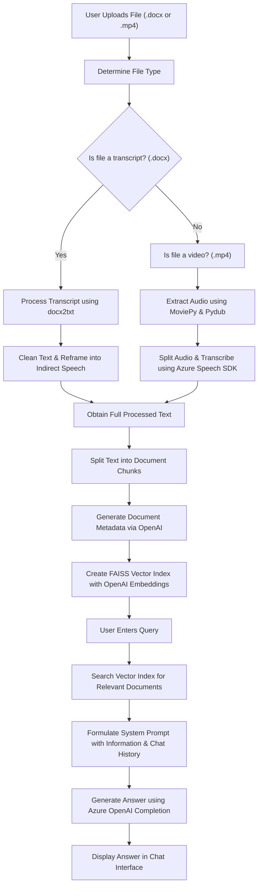

# Clustering Cancer Dataset: Unsupervised Analysis of METABRIC Data

This repository contains an unsupervised clustering analysis of the METABRIC cancer dataset. The analysis is implemented in the Jupyter Notebook `METABRIC_Unsupervised_Manu_M_L.ipynb` and explores different methodologies to uncover patterns in cancer data. Two distinct approaches are provided for clustering the dataset, enabling users to compare and contrast their performance and interpretability.

## Table of Contents

- [Overview](#overview)
- [Key Approaches](#key-approaches)
- [Workflow](#workflow)
- [Setup & Installation](#setup--installation)
- [Usage](#usage)
- [Dependencies](#dependencies)
- [Future Enhancements](#future-enhancements)
- [License](#license)
- [Acknowledgements](#acknowledgements)

## Overview

The METABRIC dataset is widely used in cancer research to study tumor heterogeneity and identify potential subtypes based on gene expression, clinical features, and other biomarkers. This project performs unsupervised clustering on the METABRIC dataset to enable deeper insights into cancer subtypes and patient stratification without prior labels.

## Key Approaches

This repository offers two complementary approaches to unsupervised clustering:

1. **Traditional Clustering Approach:**
   - Uses classical clustering algorithms (e.g., K-Means, Hierarchical Clustering).
   - Involves standard data preprocessing steps such as normalization, dimensionality reduction, and feature selection.
   - Provides baseline clustering results and visualizations that help in identifying potential clusters within the dataset.

2. **Advanced Pipeline Approach:**
   - Incorporates modern techniques for dimensionality reduction (e.g., PCA, t-SNE, or UMAP) combined with clustering.
   - Explores the use of deep learning techniques where applicable to enhance clustering performance.
   - Aims to achieve improved cluster stability and interpretability by integrating multiple data processing stages.

Both approaches are detailed in the notebook and provide valuable insights into the behavior of the METABRIC dataset from different analytical perspectives.

## Workflow

1. **Data Loading & Preprocessing:**
   - Import the METABRIC dataset.
   - Perform data cleaning, normalization, and preliminary feature selection.
  
2. **Clustering Analysis:**
   - **Traditional Approach:** 
     - Apply standard clustering algorithms.
     - Visualize clusters using plots and statistical summaries.
   - **Advanced Pipeline Approach:**
     - Apply dimensionality reduction techniques.
     - Perform clustering subsequent to embedding the data in a lower-dimensional space.
     - Compare clustering outcomes with the traditional methods.
  
3. **Evaluation & Visualization:**
   - Compare results using silhouette scores, cluster stability metrics, and domain-specific insights.
   - Visualize clusters with scatter plots, dendrograms, and heatmaps.

4. **Interpretation:**
   - Derive insights regarding distinct cancer subtypes.
   - Integrate clinical features to assess the clinical relevance of the identified clusters.

## Flowchart Diagram

Below is a flowchart diagram that summarizes the data flow and processing steps:



## Setup & Installation

1. **Clone the Repository:**
   ```bash
   git clone https://github.com/manuml1312/Clustering_Cancer_Dataset.git
   cd Clustering_Cancer_Dataset
   ```

2. **Create a Virtual Environment:**
   ```bash
   python -m venv venv
   source venv/bin/activate  # For Windows: venv\Scripts\activate
   ```

3. **Install Dependencies:**
   ```bash
   pip install -r requirements.txt
   ```

## Usage

- Open the notebook `METABRIC_Unsupervised_Manu_M_L.ipynb` using Jupyter Notebook or JupyterLab.
- Follow the instructions within the notebook to perform the unsupervised clustering analysis.
- Adjust parameters in individual cells as needed to experiment with different clustering methods.

## Dependencies

The project relies on several Python libraries including:
- Python (>= 3.8)
- NumPy, Pandas
- Scikit-learn
- Matplotlib, Seaborn
- Jupyter Notebook
- Additional libraries for advanced analysis (e.g., TensorFlow, PyTorch, or other deep learning frameworks if used)

Please refer to the `requirements.txt` file for the complete list of dependencies.

## Future Enhancements

- **Method Comparison:** Provide a detailed performance comparison of the two clustering approaches.
- **Integration with Clinical Data:** Explore how clustering results align with patient outcomes and clinical markers.
- **Automated Reporting:** Generate automated reports and dashboards summarizing key findings.
- **Scalability:** Optimize the pipelines for larger datasets and explore cloud-based solutions for computation.

## License

This project is licensed under the MIT License.

## Acknowledgements

We acknowledge the contributions of the research community in providing the METABRIC dataset and the developers of the various open-source libraries used in this project. Special thanks to all contributors and sponsors who supported this research.
