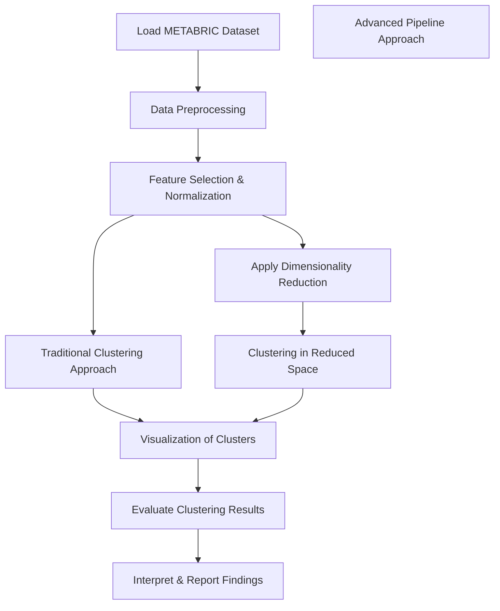

# Clustering Cancer Dataset: Unsupervised Analysis of METABRIC Data

This repository contains an unsupervised clustering analysis of the METABRIC cancer dataset. The analysis is implemented in the Jupyter Notebook `METABRIC_Unsupervised_Manu_M_L.ipynb` and explores different methodologies to uncover patterns in cancer data. Two distinct approaches are provided for clustering the dataset, enabling users to compare and contrast their performance and interpretability.

## Table of Contents

- [Overview](#overview)
- [Key Approaches](#key-approaches)
- [Workflow](#workflow)
- [Flowchart Diagram](#flowchart-diagram)
- [Setup & Installation](#setup--installation)
- [Usage](#usage)
- [Dependencies](#dependencies)
- [Future Enhancements](#future-enhancements)
- [License](#license)
- [Acknowledgements](#acknowledgements)

## Overview

The METABRIC dataset is widely used in cancer research to study tumor heterogeneity and identify potential subtypes based on gene expression, clinical features, and other biomarkers. This project performs unsupervised clustering on the METABRIC dataset to enable deeper insights into cancer subtypes and patient stratification without prior labels.

## Key Approaches

This repository offers two complementary approaches to unsupervised clustering:

1. **Traditional Clustering Approach:**
   - Uses classical clustering algorithms (e.g., K-Means, Hierarchical Clustering).
   - Involves standard data preprocessing steps such as normalization, dimensionality reduction, and feature selection.
   - Provides baseline clustering results and visualizations that help in identifying potential clusters within the dataset.

2. **Advanced Pipeline Approach:**
   - Incorporates modern techniques for dimensionality reduction (e.g., PCA, t-SNE, or UMAP) combined with clustering.
   - Explores the use of advanced processing pipelines to improve clustering performance.
   - Aims to achieve improved cluster stability and interpretability by integrating multiple data processing stages.

## Workflow

1. **Data Loading & Preprocessing:**
   - Load the METABRIC dataset.
   - Clean and normalize data.
   - Perform feature selection and scaling.

2. **Clustering Analysis:**
   - **Traditional Approach:** 
     - Apply classical clustering algorithms.
     - Visualize clusters using scatter plots and dendrograms.
   - **Advanced Pipeline Approach:**
     - Apply dimensionality reduction (e.g., PCA, t-SNE, or UMAP).
     - Cluster data in the lower-dimensional space.
     - Compare and analyze results with traditional methods.

3. **Evaluation & Interpretation:**
   - Evaluate clusters using metrics like silhouette scores.
   - Visualize clusters and interpret their significance.
   - Report findings and derive biological insights.

## Flowchart Diagram

Below is a flowchart diagram that outlines the data processing and clustering workflow as implemented in `METABRIC_Unsupervised_Manu_M_L.ipynb`:



## Setup & Installation

1. **Clone the Repository:**
   ```bash
   git clone https://github.com/manuml1312/Clustering_Cancer_Dataset.git
   cd Clustering_Cancer_Dataset
   ```

2. **Create a Virtual Environment:**
   ```bash
   python -m venv venv
   source venv/bin/activate  # On Windows: venv\Scripts\activate
   ```

3. **Install Dependencies:**
   ```bash
   pip install -r requirements.txt
   ```

## Usage

- Open the notebook `METABRIC_Unsupervised_Manu_M_L.ipynb` using Jupyter Notebook or JupyterLab.
- Follow the notebook cells to load the dataset, preprocess the data, run clustering analyses, and visualize the results.
- Adjust parameters in the notebook cells as needed for further experimentation.

## Dependencies

The project requires the following Python libraries:
- Python (>= 3.8)
- NumPy and Pandas for data manipulation
- Scikit-learn for clustering algorithms
- Matplotlib and Seaborn for visualization
- Jupyter Notebook or JupyterLab for running the analysis
- Additional libraries based on the specific approaches used (e.g., PCA, t-SNE, or UMAP implementations)

Refer to the `requirements.txt` file for a complete list of dependencies.

## Future Enhancements

- **Method Comparison:** Detailed performance comparison between the traditional and advanced clustering approaches.
- **Integration with Clinical Data:** Enhance clustering analysis by integrating clinical outcomes.
- **Automated Reporting:** Generate comprehensive reports and dashboards summarizing key findings.
- **Scalability:** Adapt the pipelines for large-scale datasets and incorporate cloud-based computing where applicable.

## License

This project is licensed under the MIT License.

## Acknowledgements

We thank the research community for providing the METABRIC dataset and acknowledge the developers of the open-source libraries that facilitated this analysis.
